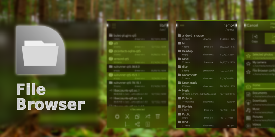

<!--
SPDX-FileCopyrightText: 2018-2026 Mirian Margiani
SPDX-FileCopyrightText: 2013-2016 Kari Pihkala
SPDX-FileCopyrightText: 2013 Michael Faro-Tusino
SPDX-License-Identifier: GFDL-1.3-or-later
-->

# File Browser for Sailfish OS

A comprehensive file manager for local files on [Sailfish OS](https://sailfishos.org/).

This repository contains the development of version 2.0.0 and upwards of File Browser.
See the [release notes](https://github.com/ichthyosaurus/harbour-file-browser/blob/main/CHANGELOG.md)
for further details.

## Features

- Browse and search files and folders
- Share files and open files in an external app
- Preview contents of images files, audio files, video files,
  compressed archives, databases, etc.
- Select multiple files (by tapping the file icons)
- Quickly copy, link, or move large amounts of files at once
- Bulk rename, delete, or edit files and folders
- Edit file and folder permissions
- Create new files and folders
- Show and hide hidden files (filenames starting with a dot)
- Open multiple windows and move files between them
- Copy, edit, or manually enter paths
- Quickly filter files from the top pulley menu
- Set per-folder view preferences
- Save custom quick shortcuts for navigating and moving files

... and much more.

**Remember:** this is a power tool, so be careful.

## Limitations in Jolla's Harbour store

File Browser in Jolla's Harbour store cannot show all files due to mandatory
sandboxing (Sailjail) since Sailfish OS 4.4. Inaccessible folders appear empty
as there is no way for the app to determine if a folder is actually empty or
simply presented as empty by the system.

Additionally, some file previews and integrated access to storage settings are
disabled.

The version on [OpenRepos](https://openrepos.net/content/ichthyosaurus/file-browser)
is not affected by these limitations.

## Permissions

File Browser requires the following permissions:

- Audio: for playing previews of audio files
- MediaIndexing: to list all documents
- RemovableMedia: for browsing USB sticks and SD cards
- UserDirs and PublicDir: to show as many files as possible while restricted by Sailjail

**Note:** sandboxing is only enabled for builds in Jolla's Harbour store. The
version on [OpenRepos](https://openrepos.net/content/ichthyosaurus/file-browser)
has no such restrictions and can show all files.

## Root mode

File Browser can run with administrator privileges to give you unrestricted access to
your system. To use this feature, you must install
[Root mode for File Browser](https://openrepos.net/content/ichthyosaurus/root-mode-file-browser-v2)
from OpenRepos. Root mode is protected by your lock code.

## Help and support

There is a [FAQ](https://github.com/ichthyosaurus/harbour-file-browser/blob/main/FAQ.md) about some common questions.
If your question is not listed there, you are welcome to
[leave a comment in the forum](https://forum.sailfishos.org/t/file-browser-support-and-feedback-thread/4566)
if you have any questions or ideas.

## Translations

It would be wonderful if the app could be translated in as many languages as possible!

Translations are managed using
[Weblate](https://hosted.weblate.org/projects/harbour-file-browser/translations).
Please prefer this over pull request (which are still welcome, of course).
If you just found a minor problem, you can also
[leave a comment in the forum](https://forum.sailfishos.org/t/file-browser-support-and-feedback-thread/4566)
or [open an issue](https://github.com/ichthyosaurus/harbour-file-browser/issues/new).

Please include the following details:

1. the language you were using
2. where you found the error
3. the incorrect text
4. the correct translation

### Manually updating translations

Please prefer using
[Weblate](https://hosted.weblate.org/projects/harbour-file-browser) over this.
You can follow these steps to manually add or update a translation:

1. *If it did not exist before*, create a new catalog for your language by copying the
   base file [translations/harbour-file-browser.ts](translations/harbour-file-browser.ts).
   Then add the new translation to [harbour-file-browser.pro](harbour-file-browser.pro).
2. Add yourself to the list of translators in [TRANSLATORS.json](TRANSLATORS.json),
   in the section `extra`.
3. (optional) Translate the app's name in [harbour-file-browser.desktop](harbour-file-browser.desktop)
   if there is a (short) native term for it in your language.

See [the Qt documentation](https://doc.qt.io/qt-5/qml-qtqml-date.html#details) for
details on how to translate date formats to your *local* format.

## Building and contributing

*Bug reports, and contributions for translations, bug fixes, or new features are always welcome!*

1. Clone the repository by running `git clone https://github.com/ichthyosaurus/harbour-file-browser.git`
2. Open `harbour-file-browser.pro` in Sailfish OS IDE (Qt Creator for Sailfish)
3. To run on emulator, select the `i486` target and press the run button
4. To build for the device, select the `aarch64` or `armv7hl` target and click “deploy all”;
   the RPM packages will be in the `RPMS` folder

If you contribute, please do not forget to add yourself to the list of
contributors in [qml/pages/AboutPage.qml](qml/pages/AboutPage.qml)!

## Acknowledgements

File Browser had been developed since 2013 by [karip](https://github.com/karip)
up until version 1.8.0. Source code and compiled packages of legacy versions
(which were released into the public domain) are still available in karip's
repository [on Github](https://github.com/karip/harbour-file-browser).

Exif data embedded in image files is displayed with
[JHead](http://www.sentex.net/~mwandel/jhead/), which is a public domain Exif
manipulation tool.

## Donations

If you want to support my work, I am always happy if you buy me a cup of coffee
through [Liberapay](https://liberapay.com/ichthyosaurus).

Of course it would be much appreciated as well if you support this project by
contributing to translations or code! See above how you can contribute 🎕.

## Anti-AI policy <a id='ai-policy'/>

AI-generated contributions are forbidden.

Please be transparent, respect the Free Software community, and adhere to the
licenses. This is a welcoming place for human creativity and diversity, but
AI-generated slop is going against these values.

Apart from all the ethical, moral, legal, environmental, social, and technical
reasons against AI, I also simply don't have any spare time to review
AI-generated contributions.

## License

> Copyright (C) 2019-2026  Mirian Margiani
>
> Copyright (C) 2013-2019  karip

File Browser is Free Software released under the terms of the
[GNU General Public License v3 (or later)](https://spdx.org/licenses/GPL-3.0-or-later.html).
The source code is available [on Github](https://github.com/ichthyosaurus/harbour-file-browser).
All documentation is released under the terms of the
[GNU Free Documentation License v1.3 (or later)](https://spdx.org/licenses/GFDL-1.3-or-later.html).

This project follows the [REUSE specification](https://api.reuse.software/info/github.com/ichthyosaurus/harbour-file-browser).
